# Transport Drones 模组架构思维导图

```mermaid
graph TB
    %% 根节点
    TD[Transport Drones 模组<br/>运输无人机模组]
    
    %% 三大阶段
    TD --> Settings[Settings Stage<br/>设置阶段<br/>📋 模组配置参数]
    TD --> Data[Data Stage<br/>数据阶段<br/>🏗️ 定义游戏原型]
    TD --> Runtime[Runtime Stage<br/>运行时阶段<br/>⚡ 处理游戏事件]
    
    %% 设置阶段详细
    Settings --> FS[Fuel Settings<br/>燃料设置<br/>🛢️ 燃料流体类型]
    Settings --> PS[Performance Settings<br/>性能设置<br/>⚙️ 无人机速度等]
    
    %% 数据阶段详细
    Data --> Entities[实体定义 Entities]
    Data --> Technologies[科技定义 Technologies]
    Data --> UI[用户界面 UI]
    Data --> Tiles[图块定义 Tiles]
    
    %% 实体子类
    Entities --> Drones[无人机实体<br/>Transport Drones<br/>🚁 多种外观变体]
    Entities --> Depots[仓库实体<br/>Depot Entities<br/>📦 各种仓库类型]
    Entities --> Circuits[电路组件<br/>Circuit Components<br/>⚡ 电路网络接口]
    
    %% 仓库类型
    Depots --> Supply[供应仓库<br/>Supply Depot<br/>📤 提供物品]
    Depots --> Request[请求仓库<br/>Request Depot<br/>📥 需求物品]
    Depots --> Buffer[缓冲仓库<br/>Buffer Depot<br/>📊 暂存物品]
    Depots --> Fuel[燃料仓库<br/>Fuel Depot<br/>⛽ 补充燃料]
    Depots --> Mining[采矿仓库<br/>Mining Depot<br/>⛏️ 自动采矿]
    Depots --> Fluid[流体仓库<br/>Fluid Depot<br/>💧 处理流体]
    
    %% 科技树
    Technologies --> Speed[运输速度<br/>Transport Speed<br/>🏃 提升无人机速度]
    Technologies --> Capacity[运输容量<br/>Transport Capacity<br/>📈 增加携带量]
    Technologies --> System[运输系统<br/>Transport System<br/>🔓 解锁新功能]
    
    %% 用户界面
    UI --> Hotkeys[热键定义<br/>Hotkeys<br/>⌨️ 快捷操作]
    UI --> Shortcuts[快捷键<br/>Shortcuts<br/>🔘 工具栏按钮]
    UI --> GUI[图形界面<br/>GUI System<br/>🖼️ 仓库配置界面]
    
    %% 运行时阶段详细
    Runtime --> EventHandler[事件处理器<br/>Event Handler<br/>📡 统一事件管理]
    Runtime --> CoreLogic[核心逻辑模块<br/>Core Logic Modules]
    
    %% 核心逻辑模块
    CoreLogic --> DroneLogic[无人机逻辑<br/>Drone Logic<br/>🤖 AI行为控制]
    CoreLogic --> NetworkLogic[网络逻辑<br/>Road Network<br/>🛣️ 道路网络管理]
    CoreLogic --> DepotLogic[仓库逻辑<br/>Depot Common<br/>📦 仓库通用功能]
    CoreLogic --> TechLogic[科技逻辑<br/>Technologies<br/>🔬 科技效果应用]
    CoreLogic --> ProxyLogic[代理逻辑<br/>Proxy Tiles<br/>🎯 位置标记]
    
    %% 无人机状态机
    DroneLogic --> States[状态机<br/>State Machine<br/>🔄 无人机行为状态]
    States --> GoingToSupply[前往供应仓库<br/>Going to Supply<br/>🎯 寻找物品]
    States --> ReturningToRequest[返回请求仓库<br/>Returning to Request<br/>🏠 送达物品]
    States --> WaitingReorder[等待重新分配<br/>Waiting for Reorder<br/>⏳ 待命状态]
    States --> DeliveringFuel[运送燃料<br/>Delivering Fuel<br/>⛽ 燃料补给]
    
    %% 道路网络系统
    NetworkLogic --> Supply_Network[供应网络<br/>Supply Network<br/>📤 物品供应跟踪]
    NetworkLogic --> Request_Network[请求网络<br/>Request Network<br/>📥 物品需求跟踪]
    NetworkLogic --> PathFinding[路径寻找<br/>Path Finding<br/>🗺️ 最优路径计算]
    
    %% 关键API使用
    DroneLogic --> APIs[Factorio APIs]
    APIs --> EntityAPI[实体API<br/>Entity API<br/>🏗️ create_entity, set_command]
    APIs --> EventAPI[事件API<br/>Event API<br/>📡 defines.events]
    APIs --> InventoryAPI[物品栏API<br/>Inventory API<br/>📦 insert, remove]
    APIs --> RenderAPI[渲染API<br/>Rendering API<br/>🎨 draw_sprite]
    APIs --> CommandAPI[命令API<br/>Command API<br/>🎮 go_to_location]
    
    %% 数据流
    Supply -.->|提供物品| Supply_Network
    Request_Network -.->|分配任务| Request
    DroneLogic -.->|状态更新| States
    NetworkLogic -.->|路径规划| DroneLogic
    
    %% 样式定义
    classDef stageNode fill:#e1f5fe,stroke:#0277bd,stroke-width:3px
    classDef entityNode fill:#f3e5f5,stroke:#7b1fa2,stroke-width:2px
    classDef logicNode fill:#e8f5e8,stroke:#388e3c,stroke-width:2px
    classDef apiNode fill:#fff3e0,stroke:#f57c00,stroke-width:2px
    classDef stateNode fill:#ffebee,stroke:#d32f2f,stroke-width:2px
    
    class Settings,Data,Runtime stageNode
    class Drones,Depots,Supply,Request,Buffer,Fuel,Mining,Fluid entityNode
    class DroneLogic,NetworkLogic,DepotLogic,TechLogic,ProxyLogic logicNode
    class EntityAPI,EventAPI,InventoryAPI,RenderAPI,CommandAPI apiNode
    class GoingToSupply,ReturningToRequest,WaitingReorder,DeliveringFuel stateNode
```



## 🔍 关键概念解释

### 📋 模组三阶段架构
1. **设置阶段 (Settings)**: 定义模组配置参数
2. **数据阶段 (Data)**: 创建游戏内容原型（实体、科技等）
3. **运行时阶段 (Runtime)**: 处理游戏事件和逻辑

### 🤖 无人机生命周期
```
创建无人机 → 接收任务 → 前往供应仓库 → 取得物品 → 返回请求仓库 → 交付物品 → 等待新任务
```

### 🛣️ 道路网络原理
- **供应网络**: 跟踪每个供应仓库的可用物品
- **请求网络**: 管理每个请求仓库的需求
- **智能匹配**: 自动分配最优的供应-请求配对

### ⚡ 核心 Factorio API
- `surface.create_entity()` - 创建游戏实体
- `entity.set_command()` - 控制单位移动
- `defines.events` - 事件类型常量
- `inventory.remove/insert()` - 物品栏操作
- `rendering.draw_sprite()` - UI渲染

### 🎯 电路网络集成
仓库可以连接电路网络，实现：
- 物品数量监控
- 条件性启用/禁用
- 自动化控制逻辑

---
*此思维导图展示了 Transport Drones 模组的完整架构，帮助理解各组件间的关系和数据流向*